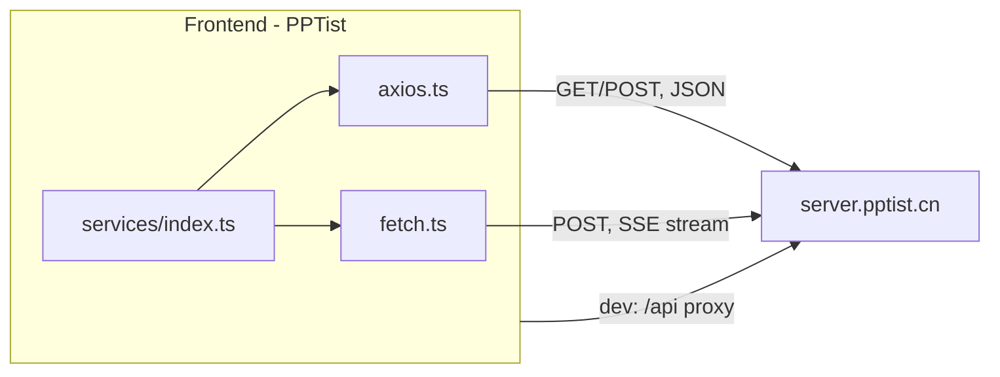

# Frontend API (Backend Connectivity)

> This document captures how the PPTist frontend connects to a backend. Investigated from the source in [`src/services`](../src/services).

## Overview

The project ships with a thin, read-oriented HTTP layer used to call the author's backend at `https://server.pptist.cn`. The layer covers AI PPT generation, image search, and AI writing. There is **no persistence layer** — slide data is never sent to the backend; saving work requires wiring the slides store ([`src/store/slides.ts`](../src/store/slides.ts)) to your own backend.

## HTTP layer

Three files make up the service layer:

| File | Purpose |
| --- | --- |
| [`index.ts`](../src/services/index.ts) | Central API module — defines `SERVER_URL` and the endpoint functions |
| [`axios.ts`](../src/services/axios.ts) | Axios instance (300s timeout, error interceptors) used for **non-streaming** requests |
| [`fetch.ts`](../src/services/fetch.ts) | Native `fetch` wrapper used for **SSE/streaming** responses |

## Base URL configuration

[`index.ts:5`](../src/services/index.ts:5) selects the backend base URL:

```ts
export const SERVER_URL = (import.meta.env.MODE === 'development') ? '/api' : 'https://server.pptist.cn'
```

- **Development** → `/api`, which is proxied by Vite to the remote server ([`vite.config.ts:36`](../vite.config.ts:36)) with the `/api` prefix stripped.
- **Production** → directly `https://server.pptist.cn`.

## Available backend endpoints

[`index.ts:38`](../src/services/index.ts:38) exposes the following methods:

| Method | Endpoint | Transport | Purpose |
| --- | --- | --- | --- |
| `getMockData(filename)` | `./mocks/{filename}.json` | Axios GET | Local mock data (not a backend call) |
| `searchImage(payload)` | `POST /tools/img_search` | Axios POST | Stock image search |
| `AIPPT_Outline(payload)` | `POST /tools/aippt_outline` | Fetch POST (streaming) | AI PPT outline generation |
| `AIPPT(payload)` | `POST /tools/aippt` | Fetch POST (streaming) | AI PPT generation |
| `AI_Writing(payload)` | `POST /tools/ai_writing` | Fetch POST (streaming) | AI writing assistant |

### Request payloads

- `searchImage`: `{ query, orientation?, locale?, order?, size?, image_type?, page?, per_page? }`
- `AIPPT_Outline`: `{ content, language, provider, model }` — sent with `stream: true`
- `AIPPT`: `{ content, language, style, provider, model }` — sent with `stream: true`
- `AI_Writing`: `{ content, command }` — sent with `stream: true`

## Key observations

- **Thin, read-oriented API.** All calls target the author's server (`https://server.pptist.cn`). Slide data is never sent to the backend; the project is a pure front-end application.
- **Streaming responses** are handled in [`fetch.ts`](../src/services/fetch.ts): it inspects the `content-type` header for `text/event-stream` or `application/octet-stream` and returns the raw `Response` for SSE consumption; otherwise it parses JSON.
- **No auth token handling** — requests send only `Content-Type: application/json`; there is no authorization header, interceptor, or user/session concept in the service layer.

## Request flow



## Connecting your own backend

To point the frontend at your own server:

1. Change `SERVER_URL` in [`index.ts:5`](../src/services/index.ts:5).
2. In development, update the Vite proxy target in [`vite.config.ts:36`](../vite.config.ts:36).
3. Implement the matching `/tools/*` endpoints (`img_search`, `aippt_outline`, `aippt`, `ai_writing`), including the SSE streaming contract used by the fetch-based methods.

For persistence, the slides store ([`src/store/slides.ts`](../src/store/slides.ts)) state needs to be saved to a database of your choosing, since the included backend offers no storage.